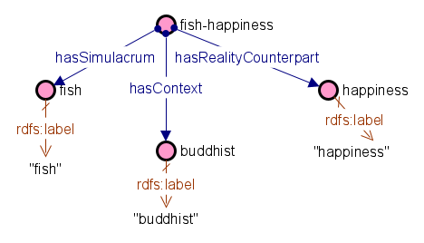

# HackaLOD
HackaLOD 2022

#### Symbolism Knowledge Graph

[HyperReal](https://w3id.org/simulation/data) is an openly available Knowledge Graph that contains more than 40000 symbol-symbolic meanings relationships, also called Simulations. The structure of Hyper Real is based on the [Simulation Ontology](https:w3id.org/simulation/ontology) which was designed to describe symbols through N-ary relationships classes (Simulations). Simulations link together a symbol (also called Simulacrum), its symbolic meaning (also called Reality Counterpart) and the cultural context in which the symbol symbolize the symbolic meaning. An example would be the fish-happiness simulation, in which fish is the symbol, happiness is the symbolic meaning, and Buddhist is the context. A visual example of the fish-happiness simulation following the simulation ontology schema can be found in figure 1.

#### Retrieving labels of symbols in English and Dutch

We used the symbols available in HyperReal to retrieve artworks that depict these symbols using the following two sources:
1. [WikiData](https://query.wikidata.org)
2. [The NMVW collection](https://collectie.wereldculturen.nl/thesaurus/#/query/fd2e81c3-dfc7-48cd-a195-f29b9b602382)

The NMVW collection contains artwork descriptions only in Dutch. Therefore, we translated all the symbols contained in HyperReal from English to Dutch. 

##### Linking HyperReal with WikiData
To link HyperReal with WikiData, we queried WikiData to find symbols from HyperReal that are depicted in paintings in Wikidata, using the property "depicts" [wikihyper.csv](https://github.com/cultural-ai/HackaLOD/blob/main/wikihyper.csv). To retrieve the labels of these symbols in English and in Dutch, we used MediaWiki API [see Jypiter notebook](https://github.com/cultural-ai/HackaLOD/blob/main/getting_wikidata_labels.ipynb). The resulting file with labels in two languages contains 2,691 entities. 191 entities did not have Dutch labels in Wikidata [qids_no_nl_labels.json](https://github.com/cultural-ai/HackaLOD/blob/main/qids_no_nl_labels.json), so we translated English labels into Dutch using Google Translate API. 

##### Linking HyperReal with the NMVW collection
We also used the Google Translate API to translate the symbols in HyperReal that didn't exist in WikiData. Finally, we created a dataframe with symbols, both in Dutch and in English. We then used this dataframe of symbols to query NMVW using the dutch translation of the symbols.

